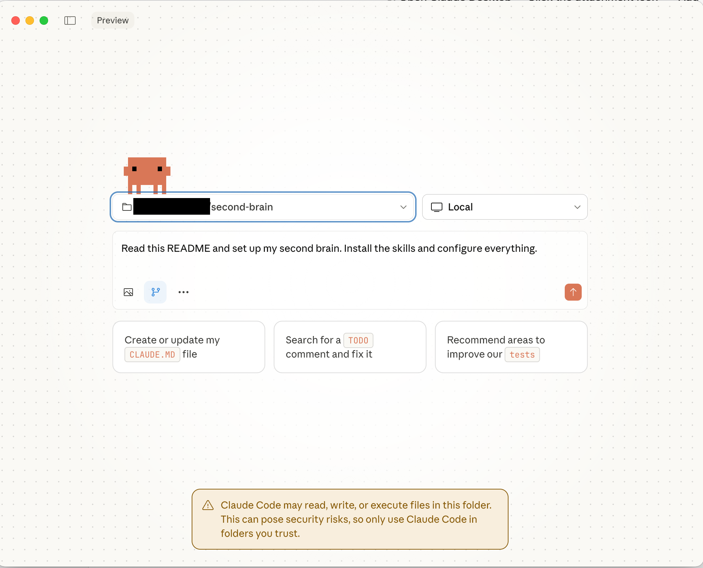
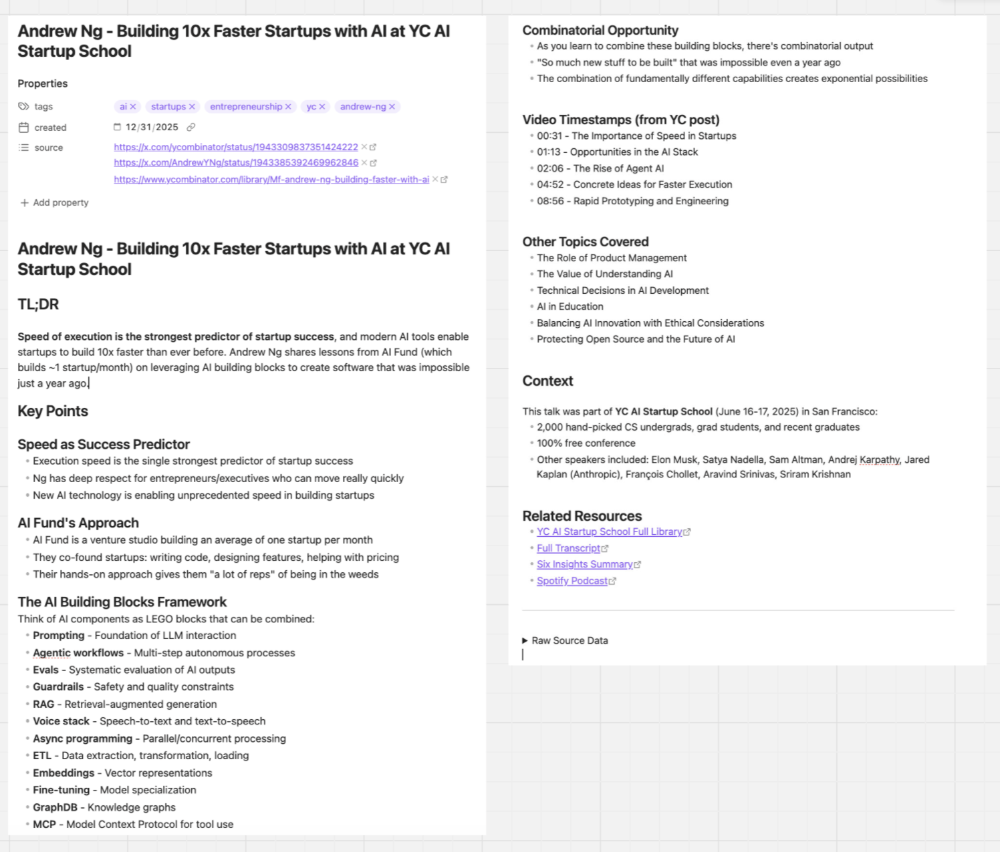
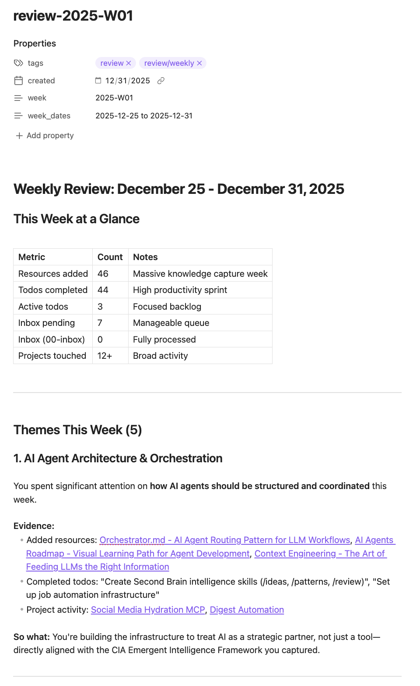

# Second Brain in a Box

> AI-powered knowledge system that makes what you read compound.

I built this to actually remember what I read. Most of us consume tons of content, bookmark it, and never go back. Or we go back, skim it, and forget it in 48 hours. Knowledge accumulates but never compounds.

This system fixes that. Four commands that turn your reading into searchable notes, synthesize what you've learned weekly, surface connections between ideas you'd never make yourself, and reveal patterns in your thinking you can't see manually.

The capture part is useful. But the real unlock is `/review`, `/ideas`, and `/patterns` - that's where your knowledge actually starts compounding.

**Setup:** 15 minutes | **Daily use:** 5 minutes | **Result:** Knowledge that compounds

---

## Choose Your Path

### Option A: Claude Desktop (Non-Technical)

No terminal required. Works with the Claude app you already have.

**Prerequisites:**
- [Claude Desktop](https://claude.ai/download) with Pro subscription (~$20/month)
- [Obsidian](https://obsidian.md) (optional, free)

**Setup:**
1. Click the green "Code" button above → "Download ZIP"
2. Unzip to your Documents folder (e.g., `Documents/second-brain`)
3. Open Claude Desktop → Click the attachment icon → "Add folder to Project" → Select the `second-brain` folder
4. Copy prompts from `skills/` folder when you need them (see Daily Workflow below)



---

### Option B: Claude Code (Technical)

Full power with slash commands. Requires terminal comfort.

**Prerequisites:**
- [Claude Code CLI](https://docs.anthropic.com/en/docs/claude-code) with Pro or Max subscription
- [Obsidian](https://obsidian.md) (optional, free)

**Setup:**
1. Clone or download:
```bash
git clone https://github.com/naushadzaman/second-brain.git ~/Documents/second-brain
cd ~/Documents/second-brain
```

2. Let Claude set it up:
```bash
claude "Read this README and set up my second brain. Install the skills and configure everything."
```

3. Restart Claude Code to load skills.

4. Open in Obsidian (optional): Open folder as vault → Select `second-brain`

---

## The Four Commands

### `/digest` - Capture Knowledge
Process any link into a structured, searchable note. Claude fetches the content, extracts key insights, pulls out quotes worth remembering, and saves it to your resources folder.

### `/review` - Weekly Synthesis
This is where the magic starts. Run it weekly and Claude scans everything you've captured, identifies themes across your reading, surfaces unfinished loops, and suggests concrete next actions. It's like having someone who's read everything you've read tell you what actually matters.

### `/ideas` - Surface Opportunities
Claude finds "collisions" between your captured knowledge and problems you're working on. That article you read three months ago? It suddenly becomes relevant to something you're facing today. Ideas that would never connect in your head get connected automatically.

### `/patterns` - Reveal Blind Spots
Zoom out on your thinking. What topics keep appearing in your captures? What contradictions exist? What are you consistently ignoring? Run this monthly and you'll see your intellectual landscape in a way you never could manually.


*Example: A digested article becomes a searchable, structured note*

---

## Daily Workflow

### Claude Desktop Users

1. Open Claude Desktop with your second-brain project attached
2. Paste the prompt from `skills/digest/SKILL.md`
3. Add your link: "Process this: https://example.com/article"
4. Claude creates a note in `03-resources/`

### Claude Code Users

```bash
cd ~/Documents/second-brain
claude "/digest https://example.com/article"
```

That's it. Claude fetches the content, extracts key insights, and creates a searchable note in `03-resources/`.

### When AI can't retrieve content

For paywalled articles or some social media, add context yourself:

> Process this: https://example.com/article
>
> Key points: Decision fatigue is real. Morning routines eliminate decisions. Batch similar tasks.

The more context you provide, the richer the note.

---

## Weekly Workflow

**Saturday or Sunday:**

*Claude Desktop:* Paste the prompt from `skills/review/SKILL.md`

*Claude Code:* `claude "/review"`

Generates:
- Themes from your week
- Key insights to keep
- Unfinished loops
- Suggested next actions


*Example: Weekly review surfaces themes and suggests next actions*

---

## Folder Structure

```
second-brain/
├── 00-inbox/        → Drop links and notes here
├── 01-todos/        → inbox.md → active.md → done.md
├── 02-projects/     → Project-specific context
├── 03-resources/    → Processed knowledge (searchable)
└── 05-reviews/      → Weekly reviews
```

---

## Philosophy

- **Calm** — No streaks, no guilt
- **Plain text** — Your data, forever readable
- **AI-first** — Claude does the heavy lifting
- **Compounding** — Knowledge builds on knowledge

---

## Common Questions

**Do I need to be technical?**
No. Use Claude Desktop (Option A). Download the zip, attach the folder, paste prompts.

**What's the difference between Claude Desktop and Claude Code?**
Claude Desktop is the regular app with a chat interface. Claude Code is a terminal tool with more power. Both work. Pick what's comfortable.

**What if I miss a day?**
No problem. The system works when you use it.

**Where does my data go?**
Your files stay on your computer. Claude sends queries to Anthropic's API, but your knowledge base is local.

---

## Advanced: Automatic Processing (Claude Code Only)

If you want to get fancy and you're comfortable with cron jobs, you can automate inbox processing. The scripts are in the `scripts/` folder:

- `digest-watcher` - Polls inbox every 5 minutes
- `digest-inbox` - Processes a single inbox file
- `install.sh` - Sets everything up

```bash
# Copy scripts to local bin
cp scripts/digest-* ~/.local/bin/
chmod +x ~/.local/bin/digest-*

# Start the watcher (polls every 5 min)
~/.local/bin/digest-watcher &

# Auto-start on reboot
(crontab -l 2>/dev/null; echo '@reboot ~/.local/bin/digest-watcher') | crontab -
```

This watches `00-inbox/` for new files and processes them automatically. Totally optional. The manual `/digest` workflow is simpler and works great.

---

## Troubleshooting

**Claude Desktop: Claude doesn't see my files?**
Make sure you attached the folder as a Project. Click the attachment icon → "Add folder to Project".

**Claude Code: Skills not working?**
```bash
ls ~/.claude/skills/
# Restart Claude Code after installing skills
```

---

## Related

- [Full Knowledge Vault README](https://gist.github.com/naushadzaman/164e85ec3557dc70392249e548b423e9) — More comprehensive system with project context, meetings, and automation

---

Your second brain grows with you. Start simple. Let it compound.
